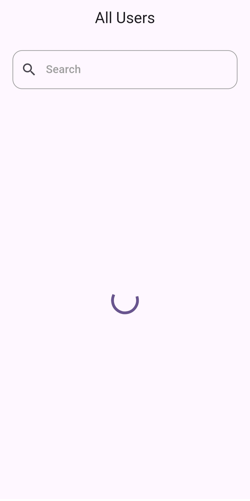
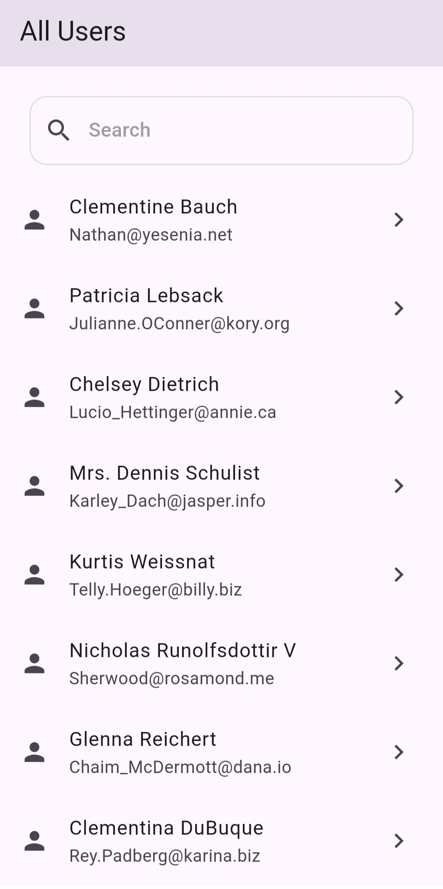

# User List App

## Project Description
The User List App is a simple Flutter application that fetches user data from a public API and displays it in a visually appealing list view. Users can view the names and email addresses of various users, refresh the list, and tap on an item to see more details about a specific user.

## API Used
The app fetches user data from the following public API:
- [JSONPlaceholder Users API](https://jsonplaceholder.typicode.com/users)

## Features
- Displays a loading indicator while fetching data.
- Shows a list of users with their names and email addresses.
- Implements pull-to-refresh functionality to refresh the user list.
- Handles errors gracefully and displays appropriate error messages.
- (Bonus) Search functionality to filter users by name.
- (Bonus) Detail screen showing more information about the user when an item in the list is tapped.

## Technical Requirements
- Built with the latest stable version of Flutter.
- State management implemented using [GetX].
- Follows best practices for error handling.
- Clean and intuitive user interface following Flutter's design principles.
- Code adheres to Dart's style guide and best practices.

## How to Run the App
1. Clone the repository:
   ```bash
   git clone https://github.com/your-username/user_list_app.git
   
2. Navigate to the project directory:
    ```bash
   cd user_list_app

3. Install the dependencies:
    ```bash
   flutter pub get

4. Run the app:
    ```bash
   flutter run
   
## Assumptions and Decisions
- Used the JSONPlaceholder API for demonstration purposes.
- Implemented GetX for state management due to its simplicity and ease of use.
- Designed the app to be responsive and user-friendly, focusing on the essential features as outlined in the requirements.

## Screenshots
<div style="display: flex; flex-wrap: wrap; justify-content: space-between; align-items: flex-start;">
    
    
    
    
    
    
    
</div>

